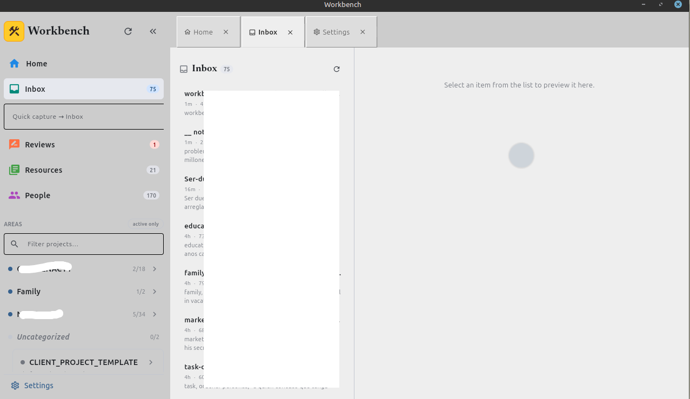
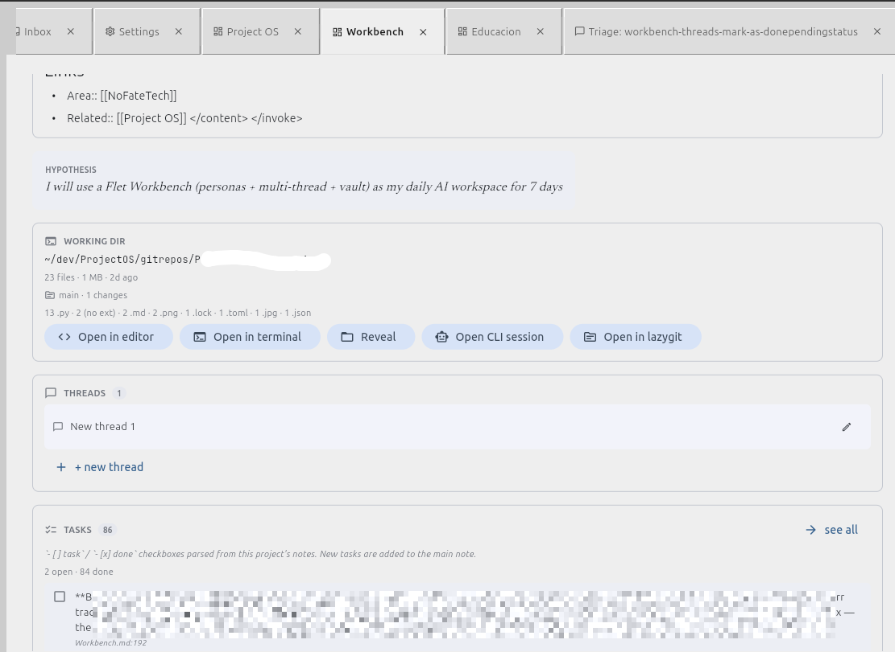

# Workbench

Local desktop "agent OS" — a [Flet](https://flet.dev)/Python app that turns a
folder of Markdown (an Obsidian vault) into the working memory of an AI
workspace. One chat = one agent ("Workbench") that role-switches into other
personas when you invoke them, calls tools to read/write your notes and run
shell commands, with per-call model routing (OpenRouter / local Ollama / a mock
brain for dev). Everything reads and writes the vault directly as plain
Markdown — no database, no lock-in.

It's built around **Project OS**: the idea that everything you do is a
*project = experiment* that runs a simple loop. The app surfaces that loop —
projects, areas, an inbox, weekly reviews — straight from your files. See
[`vault-conventions.md`](../../docs/vault-conventions.md) for the layout (it's
the shared Workbench spec at the repo root, not specific to this edition).

> ⚠️ **Trust mode.** With tools on (the default) the agent edits files and runs
> shell commands on your machine *without confirmation prompts*. Read the
> [Trust mode](#trust-mode--what-the-app-can-do-to-your-machine) section before
> you turn off mock mode.

## Screenshots

| | |
| --- | --- |
|  |  |
| Sidebar (Home / Inbox / Reviews / areas) + inbox triage list | Project overview — note, working_dir launchers, threads, tasks |

More screens (Home, Reviews board, chat, settings, the vault in Obsidian) are in
[`docs/screenshots/`](docs/screenshots/). They're real-vault captures from
day-to-day use, so some content is partially redacted.

---

## Requirements

- **Python ≥ 3.10**
- **[uv](https://docs.astral.sh/uv/)** for dependency management
- An **[OpenRouter](https://openrouter.ai) API key** for real model responses
  (optional — the app runs in mock mode without one)
- Optional: **[Ollama](https://ollama.com)** for local models
- Built and tested on **Linux**. The default shell-out commands (editor,
  terminal, git UI) assume Linux tools — see [Configuration](#configuration) to
  change them for macOS/Windows.

## Setup

```bash
git clone git@github.com:nofatetech/ProjectOSWorkbench.git
cd ProjectOSWorkbench/editions/flet-python
ln -s /path/to/your-vault vault    # symlink your vault (gitignored)
uv sync
uv run flet run
```

The `vault/` symlink must point at a folder laid out the Project OS way — at
minimum a `10_Projects/` folder and a `_System/Agents/` folder with at least one
agent. If you don't have one yet, **read
[`vault-conventions.md`](../../docs/vault-conventions.md)** — it has the folder
structure, frontmatter, starter templates, and a from-scratch bootstrap. You can
also set the vault path from Settings instead of the symlink.

## First run — mock mode

The app starts in **force-mock** mode by default: every agent call returns an
instant fake response. No API key needed, no tokens burned, no files touched —
useful for clicking around the UI. Nothing is real until you turn it off.

## Going live

Click **Settings** at the bottom of the sidebar:

1. Paste your OpenRouter API key (https://openrouter.ai/keys).
2. Toggle **Force mock mode** off.
3. Pick a **chat model** (any OpenRouter slug, or an `ollama/...` one).
4. Save — writes `~/.workbench/config.json` (chmod 600).

### Model routing

The model string's prefix decides where a call goes:

| Prefix | Routes to | Example |
| --- | --- | --- |
| `mock/<anything>` | `MockBrain` (instant fake) | `mock/test` |
| `ollama/<model>` | local Ollama (`ollama_base_url`) | `ollama/qwen2.5:3b` |
| `openrouter/<provider>/<model>` | OpenRouter | `openrouter/anthropic/claude-opus-4-7` |
| `<provider>/<model>` (no prefix) | OpenRouter (default) | `anthropic/claude-opus-4-7` |

`force_mock` overrides everything — every call uses `MockBrain`. Tool-calling
quality varies by model: frontier models (Opus, etc.) call tools reliably; small
local models may narrate actions instead of calling the tool. Pick a strong
model as your `chat_model` if you rely on the file/shell tools.

## Agents

Personas live in `_System/Agents/*.md` in your vault. The body is the system
prompt:

```markdown
---
type: agent
model: anthropic/claude-opus-4-7
icon: architecture
---

# Architect

Senior software architect. Opinionated, pragmatic. Pushes for the simplest
implementation that proves the central hypothesis.
```

Edit them in your editor; Workbench picks up changes on next launch. `icon:`
accepts any Material icon name (`smart_toy`, `face`, `psychology`, …).

## What it does

- **Chat with tools.** Streaming replies; the agent reads/writes vault notes,
  lists folders, moves notes, and runs shell commands via tools (see below).
- **Conversation tree.** Every turn has a parent — branch from any node,
  regenerate (keeps the old branch), and pin nodes. Threads persist across
  restarts as JSON.
- **Per-thread prompt override.** The 🎛 button freezes a custom system prompt
  for one thread; reset to fall back to the live auto-assembled one.
- **`@`-references.** Type `@` in the input to fuzzy-pick a file from the
  project's vault folder or its `working_dir`; the agent reads it via tools.
- **Projects.** Each project's overview renders its main note, lists tasks
  (click to toggle, written back to the note), and creates new notes/posts.
  A `working_dir` card opens the folder in your editor / terminal / file
  manager / lazygit, or launches a CLI coding-agent session.
- **Inbox triage ("Ask Workbench").** Hand an `00_Inbox/` note to the agent with
  a note of what you know; it files/creates/edits for real via tools.
- **Quick capture.** A box under the Inbox row drops a note into `00_Inbox/`.
  Optionally, a **Telegram bot** captures notes from your phone into the inbox.
- **Reviews surface.** A due board (kanban by `review:` date with inline
  Persist/Pause/Pivot writeback + status log) and a GitHub-style reflections
  grid that seeds weekly-review threads.
- **Demand probes.** `active` projects tagged `demand-probe` get their own Home
  section, sorted stalest-first. (See `docs/vault-conventions.md`.)
- **Themeable.** Light "Platinum" surface theme + configurable title styles.

## Tools

When tools are enabled (default), the agent can call:

| Tool | Does |
| --- | --- |
| `read_vault_note` | read a note (vault-relative or absolute path) |
| `write_vault_note` | create or overwrite a note |
| `move_note` | move/rename a note |
| `list_dir` | list a folder |
| `run_shell` | run a shell command in the project's `working_dir` |
| `delegate_to_claude_code` | (opt-in) run a headless CLI agent and poll for the result |

Toggle them off in **Settings → Enable tools** for a read-only chat.

## Trust mode — what the app can do to your machine

Workbench runs the agent in **trust mode**, the same model as a coding-agent
CLI. With tools enabled and a real model selected, it acts on your machine
**without per-action confirmation prompts**:

- `write_vault_note` / `move_note` create, overwrite, and move files in your
  vault directly.
- `run_shell` runs arbitrary shell commands in the project's `working_dir`.
- `delegate_to_claude_code` (off by default) launches a headless CLI agent under
  `bypassPermissions`.

There is **no sandbox and no undo beyond git.** Recommended: only point `vault`
at a directory you keep under version control, review what the agent did with
`git diff`, and treat `run_shell` with the caution you'd give a terminal. If
you're just exploring, the default **force-mock** mode does none of this — no
key, no tool calls, no file writes.

## Configuration

State lives in `~/.workbench/` (none of it in the repo):

- `config.json` — preferences + OpenRouter key (chmod 600)
- `threads/` — one JSON file per chat thread
- `telegram.json` — bot token + claimed owner id (chmod 600)

Edit settings in-app (Settings tab) or in `config.json`. Notable fields:

| Field | Default | Meaning |
| --- | --- | --- |
| `vault_path` | `""` (use the `vault` symlink) | absolute path to your vault |
| `openrouter_api_key` | `""` | OpenRouter key |
| `ollama_base_url` | `http://localhost:11434/v1` | local Ollama endpoint |
| `force_mock` | `true` | route every call to `MockBrain` |
| `tools_enabled` | `true` | let the agent call tools |
| `chat_model` | `anthropic/claude-opus-4-7` | model for the chat agent |
| `editor_command` | `zed {path}` | open a folder/file in your editor |
| `terminal_command` | `gnome-terminal --working-directory={path}` | open a terminal |
| `git_ui_command` | `lazygit` | git TUI launched from the working_dir card |
| `delegate_enabled` | `false` | enable the headless `delegate_to_claude_code` tool |

Set `WORKBENCH_DEBUG_PROMPTS=1` to print the exact message payload sent to the
model (system prompt + history) to stderr for one run.

## Architecture

Sidebar lists projects + agents (read from the vault). The main area is a tab
strip over a pluggable view slot — tabs are `OpenTab(kind, ref_id)`, so chat /
overview / agent / reviews / settings views share one strip. Sending a message
runs `_dispatch_single()` on a daemon thread: it calls `brain_for(model, config)`
for a routed brain (mock / OpenRouter / Ollama), streams the reply into the turn
while the UI re-renders per chunk, and runs a tool loop (up to 8 iterations) —
emit `tool_calls` → execute → feed results back → continue — until the agent
returns final text. Threads persist as JSON under `~/.workbench/threads/`; the
conversation is a `parent_id` tree (branches, pins, regenerate).

### Source layout (`src/`)

| File | Responsibility |
| --- | --- |
| `main.py` | the Flet app — views, state, dispatch, all UI |
| `models.py` | data model (Project, Thread, Turn, …) |
| `brain.py` | model routing + streaming (Mock / OpenRouter / Ollama) + tool-call parsing |
| `tools.py` | the agent's tool registry + execution + CLI delegation |
| `vault.py` | read/write/scan layer over the vault |
| `store.py` | thread persistence (JSON) |
| `config.py` | `~/.workbench/config.json` + title-theme presets |
| `osactions.py` | OS/shell launchers (editor, terminal, file manager, git UI) |
| `telegram_capture.py` / `telegram_daemon.py` | phone-to-inbox capture bot |
| `theme.py` / `title_themes.json` | the Platinum theme + title-style presets |

## Development

```bash
uv run python scripts/check_build_refs.py   # static guard: every self.<attr> is defined
uv run python scripts/smoke_build.py         # headless build of every view (catches Flet kwarg errors)
```

Both run without a display. Keep `force_mock` on while iterating on UI so you
don't burn tokens. `docs/testing-tools.md` walks through exercising the agent's
tool-calling by hand.

## License

Public domain — the whole repo is released under
[The Unlicense](../../LICENSE). No copyright, no attribution required. Copy,
modify, sell, or do whatever you want with it.
