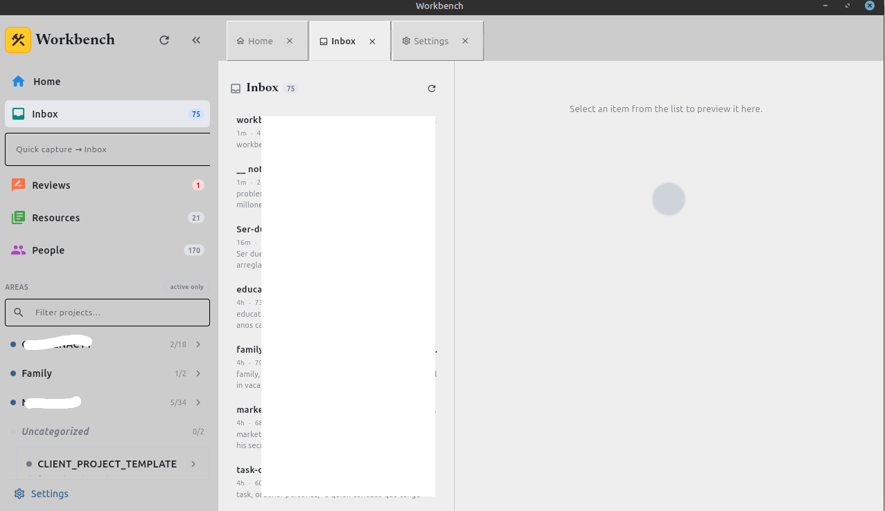
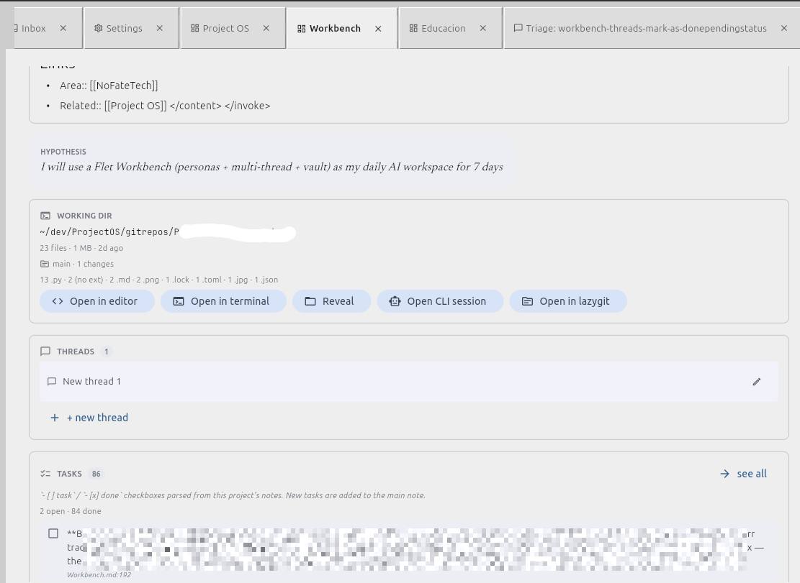

# Workbench

Local desktop "agent OS" — a [Flet](https://flet.dev)/Python app that turns a
folder of Markdown (an Obsidian vault) into the working memory of an AI
workspace. One chat = one agent ("Workbench") that role-switches into other
personas when you invoke them, calls tools to read/write your notes and run
shell commands, with per-call model routing (OpenRouter / local Ollama / a mock
brain for dev). Everything reads and writes the vault directly as plain
Markdown — no database, no lock-in.

It's built around **Project OS**: the idea that everything you do is a
*project = experiment* that runs a simple loop. The app surfaces that loop —
projects, areas, an inbox, weekly reviews — straight from your files. See
[`vault-conventions.md`](../../docs/vault-conventions.md) for the layout (it's
the shared Workbench spec at the repo root, not specific to this edition).

> ⚠️ **Trust mode.** With tools on (the default) the agent edits files and runs
> shell commands on your machine *without confirmation prompts*. Read the
> [Trust mode](#trust-mode--what-the-app-can-do-to-your-machine) section before
> you turn off mock mode.

## Screenshots

| | |
| --- | --- |
|  |  |
| Sidebar (Home / Inbox / Reviews / areas) + inbox triage list | Project overview — note, working_dir launchers, threads, tasks |

More screens (Home, Reviews board, chat, settings, the vault in Obsidian) are in
[`docs/screenshots/`](docs/screenshots/). They're real-vault captures from
day-to-day use, so some content is partially redacted.

---

## Requirements

- **Python ≥ 3.10**
- **[uv](https://docs.astral.sh/uv/)** for dependency management
- An **[OpenRouter](https://openrouter.ai) API key** for real model responses
  (optional — the app runs in mock mode without one)
- Optional: **[Ollama](https://ollama.com)** for local models
- Built and tested on **Linux**. The default shell-out commands (editor,
  terminal, git UI) assume Linux tools — see [Configuration](#configuration) to
  change them for macOS/Windows.

## Setup

```bash
git clone git@github.com:nofatetech/ProjectOSWorkbench.git
cd ProjectOSWorkbench/editions/flet-python
ln -s /path/to/your-vault vault    # symlink your vault (gitignored)
uv sync
uv run flet run
```

The `vault/` symlink must point at a folder laid out the Project OS way — at
minimum a `10_Projects/` folder and a `_System/Agents/` folder with at least one
agent. If you don't have one yet, **read
[`vault-conventions.md`](../../docs/vault-conventions.md)** — it has the folder
structure, frontmatter, starter templates, and a from-scratch bootstrap. You can
also set the vault path from Settings instead of the symlink.

## First run — mock mode

The app starts in **force-mock** mode by default: every agent call returns an
instant fake response. No API key needed, no tokens burned, no files touched —
useful for clicking around the UI. Nothing is real until you turn it off.

## Going live

Click **Settings** at the bottom of the sidebar:

1. Paste your OpenRouter API key (https://openrouter.ai/keys).
2. Toggle **Force mock mode** off.
3. Pick a **chat model** (any OpenRouter slug, or an `ollama/...` one).
4. Save — writes `~/.workbench/config.json` (chmod 600).

### Shopify publishing MVP

1. In the Shopify Dev Dashboard, create an app for `nofatetech.myshopify.com`
   with `write_content`, product and inventory read/write, and publication
   read/write access and install it on the store. [Client credentials](https://shopify.dev/docs/apps/build/authentication-authorization/client-credentials-grant)
   work when the app and store belong to the same Shopify organization. For an
   app installed through another authorization path, use its Admin API access
   token instead. Keep all secrets in Workbench Settings, never in vault notes.
2. In **Settings → PUBLISHING**, choose **Shopify blog**, enter the store domain
   and app credentials, then click **Connect and load blogs**. Choose one blog,
   enter the Shopify author name, and save. Shopify stores have a default `News`
   blog; you can rename it in **Content → Blog posts → Manage blogs**.
   If connection reports `app_not_installed`, releasing the app version was not
   enough: use the Dev Dashboard app's **Installs → Install app** action for this
   exact store, or its custom distribution install link.
3. Create a project post or journal note, write it in Obsidian, then use the
   cloud/publish button beside it in Workbench. Choose **Draft** or **Live on
   site**. All projects publish to the same selected blog. The note gets
   `shopify_article_id`, `shopify_blog_id`, `shopify_store`, and its URL after a
   successful push. Pushing again updates that article.
4. To email it, use **Open Shopify for optional email** from the posts card,
   then open **Apps → Messaging**. Shopify Messaging is a separate campaign
   editor: compose the email, insert the article link or excerpt, select a
   customer segment, and send or schedule it there. Publishing a blog article
   alone does not send email.
5. To grow the list, add a newsletter signup to the storefront with
   [Shopify Forms](https://help.shopify.com/en/manual/promoting-marketing/create-marketing/forms-app/settings/all-forms)
   or the theme's newsletter section, with email marketing consent enabled.
   Subscriber segments and welcome emails can then be managed in Shopify.

The same project card also supports **+ new product**. A `type: product` note
uses the same Shopify connection regardless of the selected blog provider. Its
publish button creates or updates one Shopify product; the note receives
`shopify_product_id` and `shopify_published_url`. New products start as drafts.
Choose **Live on site — contact only** to list the offer in the Online Store.
Workbench uses a single variant at zero tracked inventory, prevents overselling,
and makes shipping unnecessary. The normal Shopify purchase button is disabled;
visitors use the contact link in the product description. A direct Ajax cart
request may still add the variant, so this is a lead-first storefront convention,
not a custom checkout validation rule. Keep payment terms out of the $1 listing.

Example product note:

```markdown
---
type: product
publish: draft
price_usd: 1.00
tags: [consulting, systems]
---

# Systems Diagnosis

Describe who this helps, the scope, and the next step.
```

`price_usd` defaults to `1.00` and is a catalog placeholder, not an agreed fee.
To update an existing Shopify product from Markdown, set its exact
`shopify_product_id` in frontmatter; Workbench will reject products with multiple
variants or nonzero inventory. A product note marked private or subscriber-only
cannot go live. Product images remain managed in Shopify and are
preserved during text/price updates. Local Markdown images are not uploaded.

Product notes also accept `handle:`, `seo_title:`, `seo_description:` and
`collections: [Name]`. Listed collections are created and published if they
don't exist, and products are only ever added to them, never removed.

### Shopify tools for the chat agent

With publishing enabled and Shopify connected, the chat agent gets `shopify_*`
tools, and `type: page` notes publish as Online Store pages via `publish_note`
(fields: `handle:` and `template:`, the theme template suffix):

| Tool | What it does |
|---|---|
| `shopify_query` | Read-only Admin GraphQL (mutations refused): orders, customers, menus, analytics, settings |
| `shopify_status` | Vault notes vs store: live/draft drift, notes edited since their last push, unlinked store items |
| `shopify_unpublish` | Product → draft/archived, article/page → hidden. Never deletes |
| `shopify_upload_image` | Attach a vault image to a product, or upload it to Files and return its CDN URL |
| `shopify_theme_files` | List or read theme files (live theme by default) |
| `shopify_theme_duplicate` / `shopify_theme_write` | Edit a *copy* of a theme; writes to the live theme are refused. You publish themes in Shopify admin |

These need the app scopes for content, online store pages, products,
publications, files and themes. The mutating tools are covered by the
optional tool-confirm dialog.

Example note:

```markdown
---
type: post
title: A small update
publish: draft
tags: [field-notes]
summary: A short preview for the blog listing.
---

The post body is ordinary Markdown.
```

This MVP does not make blog articles subscriber-only or create Shopify Messaging
campaigns through an API. A **live** Shopify blog article is public; use draft
status while preparing member-only material. Workbench refuses to make a note
live if its `audience:` or `visibility:` is marked `subscribers`, `members`,
`paid`, or `private`. Obsidian `[[wikilinks]]` become plain text, and local
image paths are not uploaded to Shopify.

### Model routing

The model string's prefix decides where a call goes:

| Prefix | Routes to | Example |
| --- | --- | --- |
| `mock/<anything>` | `MockBrain` (instant fake) | `mock/test` |
| `ollama/<model>` | local Ollama (`ollama_base_url`) | `ollama/qwen2.5:3b` |
| `openrouter/<provider>/<model>` | OpenRouter | `openrouter/anthropic/claude-opus-4-7` |
| `<provider>/<model>` (no prefix) | OpenRouter (default) | `anthropic/claude-opus-4-7` |

`force_mock` overrides everything — every call uses `MockBrain`. Tool-calling
quality varies by model: frontier models (Opus, etc.) call tools reliably; small
local models may narrate actions instead of calling the tool. Pick a strong
model as your `chat_model` if you rely on the file/shell tools.

## Agents

Personas live in `_System/Agents/*.md` in your vault. The body is the system
prompt:

```markdown
---
type: agent
model: anthropic/claude-opus-4-7
icon: architecture
---

# Architect

Senior software architect. Opinionated, pragmatic. Pushes for the simplest
implementation that proves the central hypothesis.
```

Edit them in your editor; Workbench picks up changes on next launch. `icon:`
accepts any Material icon name (`smart_toy`, `face`, `psychology`, …).

## What it does

- **Chat with tools.** Streaming replies; the agent reads/writes vault notes,
  lists folders, moves notes, and runs shell commands via tools (see below).
- **Conversation tree.** Every turn has a parent — branch from any node,
  regenerate (keeps the old branch), and pin nodes. Threads persist across
  restarts as JSON.
- **Per-thread prompt override.** The 🎛 button freezes a custom system prompt
  for one thread; reset to fall back to the live auto-assembled one.
- **`@`-references.** Type `@` in the input to fuzzy-pick a file from the
  project's vault folder or its `working_dir`; the agent reads it via tools.
- **Projects.** Each project's overview renders its main note, lists tasks
  (click to toggle, written back to the note), and creates new notes/posts.
  A `working_dir` card opens the folder in your editor / terminal / file
  manager / lazygit, or launches a CLI coding-agent session.
- **Inbox triage ("Ask Workbench").** Hand an `00_Inbox/` note to the agent with
  a note of what you know; it files/creates/edits for real via tools.
- **Quick capture.** A box under the Inbox row drops a note into `00_Inbox/`.
  Optionally, a **Telegram bot** captures notes from your phone into the inbox.
- **Reviews surface.** A due board (kanban by `review:` date with inline
  Persist/Pause/Pivot writeback + status log) and a GitHub-style reflections
  grid that seeds weekly-review threads.
- **Demand probes.** `active` projects tagged `demand-probe` get their own Home
  section, sorted stalest-first. (See `docs/vault-conventions.md`.)
- **Publish to the web.** A button on each project's posts/journals creates or
  updates an article in one Shopify blog. The Markdown note stays the source;
  Shopify's article ID and URL are written back to frontmatter so the next push
  updates the same article. Choose draft or live for each push. Project and note
  tags organize posts within that one blog. WordPress.com remains a selectable
  destination for notes already using it.
- **Themeable.** Light "Platinum" surface theme + configurable title styles.

## Tools

When tools are enabled (default), the agent can call:

| Tool | Does |
| --- | --- |
| `read_vault_note` | read a note (vault-relative or absolute path) |
| `write_vault_note` | create or overwrite a note |
| `move_note` | move/rename a note |
| `list_dir` | list a folder |
| `run_shell` | run a shell command in the project's `working_dir` |
| `delegate_to_claude_code` | (opt-in) run a headless CLI agent and poll for the result |
| `publish_note` | (opt-in) publish/update a note at the configured blog destination |

Toggle them off in **Settings → Enable tools** for a read-only chat. `publish_note`
is off by default — turn it on under **Settings → PUBLISHING** ("Let the chat
agent publish").

## Trust mode — what the app can do to your machine

Workbench runs the agent in **trust mode**, the same model as a coding-agent
CLI. With tools enabled and a real model selected, it acts on your machine
**without per-action confirmation prompts**:

- `write_vault_note` / `move_note` create, overwrite, and move files in your
  vault directly.
- `run_shell` runs arbitrary shell commands in the project's `working_dir`.
- `delegate_to_claude_code` (off by default) launches a headless CLI agent under
  `bypassPermissions`.

There is **no sandbox and no undo beyond git.** Recommended: only point `vault`
at a directory you keep under version control, review what the agent did with
`git diff`, and treat `run_shell` with the caution you'd give a terminal. If
you're just exploring, the default **force-mock** mode does none of this — no
key, no tool calls, no file writes.

## Configuration

State lives in `~/.workbench/` (none of it in the repo):

- `config.json` — preferences + OpenRouter key (chmod 600)
- `threads/` — one JSON file per chat thread
- `telegram.json` — bot token + claimed owner id (chmod 600)

Edit settings in-app (Settings tab) or in `config.json`. Notable fields:

| Field | Default | Meaning |
| --- | --- | --- |
| `vault_path` | `""` (use the `vault` symlink) | absolute path to your vault |
| `openrouter_api_key` | `""` | OpenRouter key |
| `ollama_base_url` | `http://localhost:11434/v1` | local Ollama endpoint |
| `force_mock` | `true` | route every call to `MockBrain` |
| `tools_enabled` | `true` | let the agent call tools |
| `chat_model` | `anthropic/claude-opus-4-7` | model for the chat agent |
| `editor_command` | `zed {path}` | open a folder/file in your editor |
| `terminal_command` | `gnome-terminal --working-directory={path}` | open a terminal |
| `git_ui_command` | `lazygit` | git TUI launched from the working_dir card |
| `delegate_enabled` | `false` | enable the headless `delegate_to_claude_code` tool |

Set `WORKBENCH_DEBUG_PROMPTS=1` to print the exact message payload sent to the
model (system prompt + history) to stderr for one run.

## Architecture

Sidebar lists projects + agents (read from the vault). The main area is a tab
strip over a pluggable view slot — tabs are `OpenTab(kind, ref_id)`, so chat /
overview / agent / reviews / settings views share one strip. Sending a message
runs `_dispatch_single()` on a daemon thread: it calls `brain_for(model, config)`
for a routed brain (mock / OpenRouter / Ollama), streams the reply into the turn
while the UI re-renders per chunk, and runs a tool loop (up to 8 iterations) —
emit `tool_calls` → execute → feed results back → continue — until the agent
returns final text. Threads persist as JSON under `~/.workbench/threads/`; the
conversation is a `parent_id` tree (branches, pins, regenerate).

### Source layout (`src/`)

| File | Responsibility |
| --- | --- |
| `main.py` | the Flet app — views, state, dispatch, all UI |
| `models.py` | data model (Project, Thread, Turn, …) |
| `brain.py` | model routing + streaming (Mock / OpenRouter / Ollama) + tool-call parsing |
| `tools.py` | the agent's tool registry + execution + CLI delegation |
| `vault.py` | read/write/scan layer over the vault |
| `publish.py` | WordPress.com publishing (existing destination) |
| `shopify_publish.py` | Shopify blog publishing and shared API connection |
| `shopify_products.py` | Contact-first Shopify product publishing and frontmatter writeback |
| `shopify_admin.py` | Agent Shopify tools: read-only queries, sync status, pages, unpublish, images, theme files |
| `views/people.py` | the People directory view |
| `store.py` | thread persistence (JSON) |
| `config.py` | `~/.workbench/config.json` + title-theme presets |
| `osactions.py` | OS/shell launchers (editor, terminal, file manager, git UI) |
| `telegram_capture.py` / `telegram_daemon.py` | phone-to-inbox capture bot |
| `theme.py` / `title_themes.json` | the Platinum theme + title-style presets |

## Development

```bash
uv run python scripts/check_build_refs.py   # static guard: every self.<attr> is defined
uv run python scripts/smoke_build.py         # headless build of every view (catches Flet kwarg errors)
```

Both run without a display. Keep `force_mock` on while iterating on UI so you
don't burn tokens. `docs/testing-tools.md` walks through exercising the agent's
tool-calling by hand.

## License

Public domain — the whole repo is released under
[The Unlicense](../../LICENSE). No copyright, no attribution required. Copy,
modify, sell, or do whatever you want with it.
